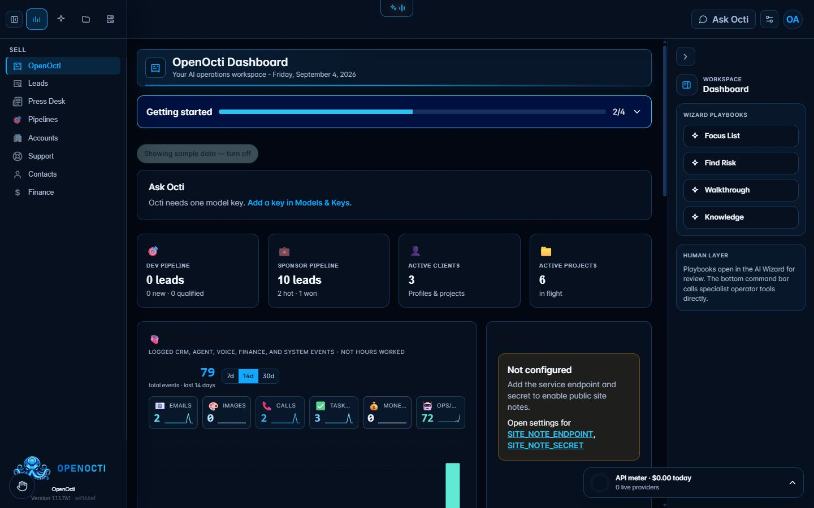
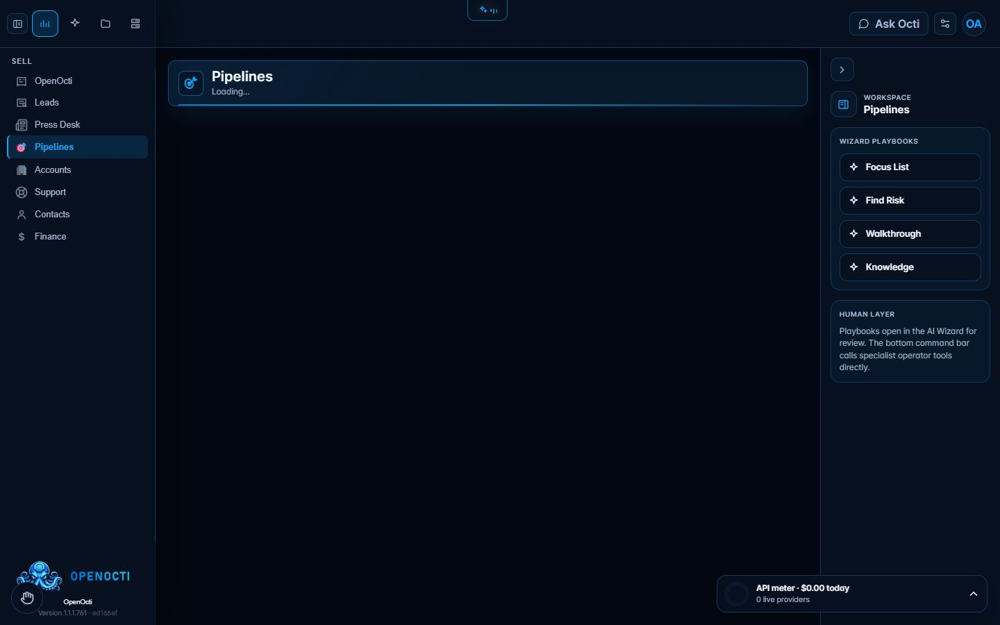
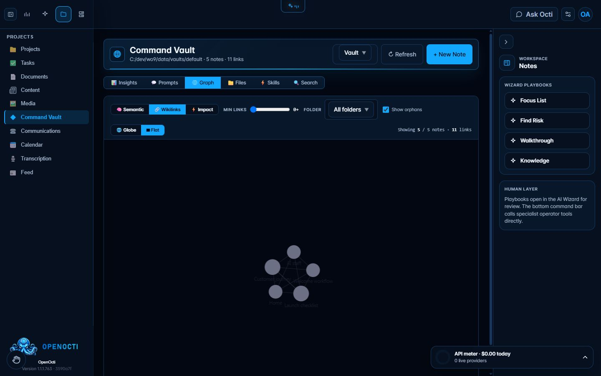
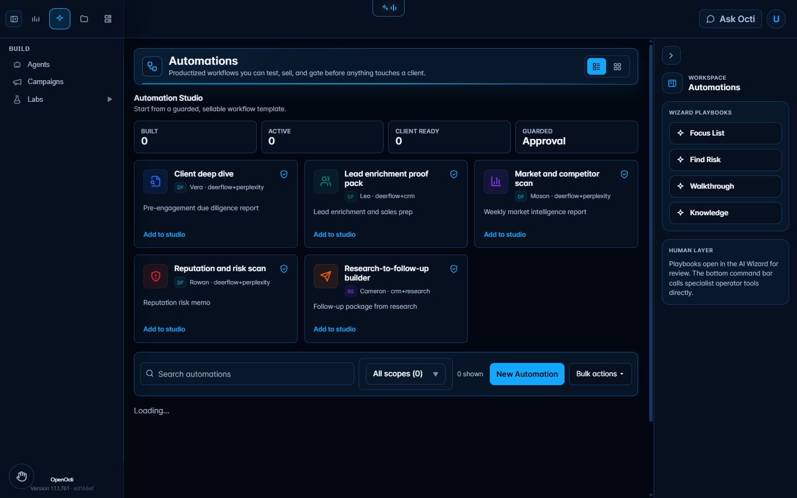
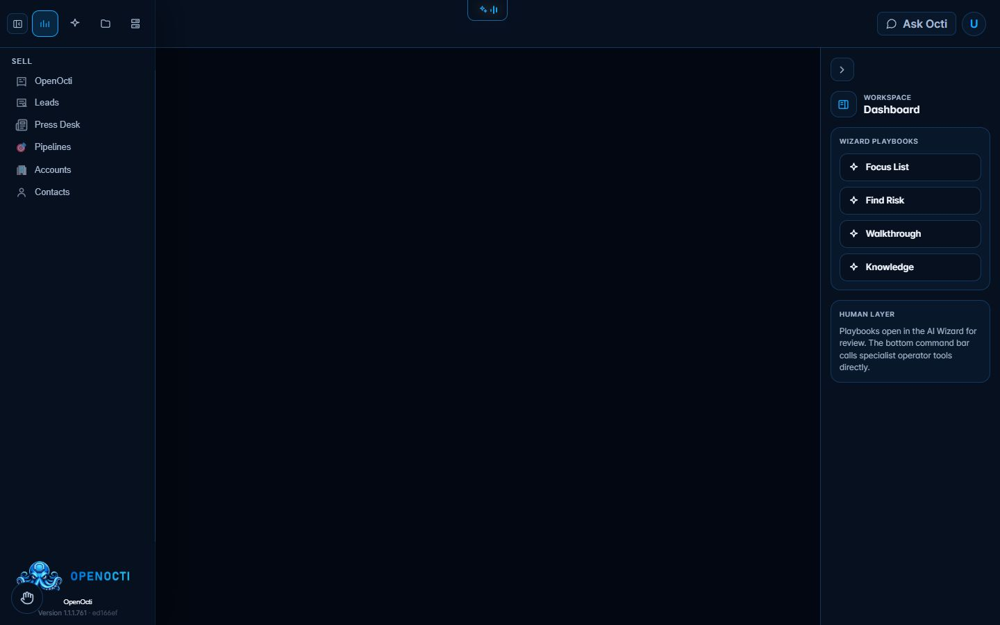

[](LICENSE) [](docs/INSTALL.md) [](https://github.com/carlucci001/open-octi/pkgs/container/open-octi) [](https://github.com/carlucci001/open-octi/actions/workflows/ci.yml) [](#support)

# OpenOcti

OpenOcti is a self-hosted business operations workspace: CRM, projects, documents, communications, automations, knowledge, and a configurable AI staff in one local-first application.

[openocti.com](https://openocti.com) · Managed edition: [Octi CC](https://octicc.com)

## Install in three lines

```bash
git clone https://github.com/carlucci001/open-octi.git openocti
cd openocti
docker compose up -d
```

Open [http://localhost:3000](http://localhost:3000) when the containers are healthy. The default command pulls the prebuilt `latest` images. Build the current checkout instead with `docker compose up -d --build`. See [Install with Node](docs/INSTALL.md) for development without Docker.

> The `latest` images for this release are published only after the `v1.1.2` tag exists. Before that tag, use the source-build command above. See the [1.1.2 security release notes](docs/releases/1.1.2.md).

## One key lights it up

The CRM, projects, documents, and local knowledge tools work without an AI provider. Add any one supported model key in Models & Keys—OpenAI, Anthropic, Google Gemini, or OpenRouter—to activate Octi and the starter staff. Voice, email, calling, and research connectors need their own provider credentials only when you enable those features. Start with [Model providers](docs/guides/model-providers.md).

## Highlights

- **A starter AI staff, one key to light it up** — Octi, Maggie, Craig, Sasha, Linda and Matilda ship as agent definitions; paste one OpenAI, Anthropic, Google Gemini or OpenRouter key in Models & Keys and they come alive on your own server. [Guide](docs/guides/agents.md) · [Screen](docs/screenshots/agents.jpg)
- **Context-aware agents on every screen** — the Operator rail follows the section and the record you have open; on a lead, one click gives you Next Calls, an email draft or a clean-data pass built from that lead. [Guide](docs/guides/operator-rail.md) · [Screen](docs/screenshots/operator-rail-lead.jpg)
- **Command Vault** — an Obsidian-compatible Markdown knowledge base built in: multiple vault roots (one per project), wikilinks, graph view, semantic search, orphan detection and a Prompt Workshop. [Guide](docs/guides/command-vault.md) · [Screen](docs/screenshots/command-vault-graph.jpg)
- **TruthDiff** — pick a note and see which knowledge is affected by what changed in Git: drift analysis between your docs and your code, built into the vault's Impact view. [Guide](docs/guides/truthdiff.md)
- **Workflows and automations** — build an automation from guarded templates, review its triggers, steps and approval gates, then run it on a schedule with the built-in runners. [Guide](docs/guides/automations.md) · [Screen](docs/screenshots/automations.jpg)
- **Built-in e-signature** — send agreements for signature without leaving the CRM: signing tokens, audit trail and email delivery, with Linda drafting the neutral agreements. [Guide](docs/guides/e-sign.md) · [Screen](docs/screenshots/documents-esign.jpg)
- **Voice, phone and meetings** — a voice receptionist (ElevenLabs + Twilio, or Gemini Live / local VibeVoice), dialer, conference, and Maggie's meeting capture that saves the transcript to Documents. [Guide](docs/guides/communications.md) · [Screen](docs/screenshots/communications.jpg)
- **Gesture Mode** — hands-free control from your webcam: pinch to click, open palm to scroll, fist to close. MediaPipe runs entirely in the browser; off by default, nothing loads until you switch it on. [Guide](docs/guides/gesture-mode.md)
- **Labs** — Agent Lab, Agent Sandbox, AI Lab, API Lab, Voice Labs, Ops Lab, Provisioning Lab and Leads Lab: try a model, a prompt, a tool or a lead spec before it touches real data. [Guide](docs/guides/labs.md) · [Screen](docs/screenshots/labs.jpg)
- **Embeddable agent widget** — put one of your agents on any website as a chat widget with human handoff. [Guide](docs/guides/agent-widget.md) · [Screen](docs/screenshots/agent-widget.jpg)
- **Yours to run** — Docker or plain Node, SQLite on a persistent volume, installable PWA, Platform Admin API and SDK, the OpenClaw gateway as a sidecar, and no hosted control plane. [Install](docs/INSTALL.md) · [Data model](docs/DATA-MODEL.md)

## Screens

| Dashboard | Pipelines |
| --- | --- |
| [](docs/screenshots/dashboard.jpg) | [](docs/screenshots/pipelines.jpg) |
| Agents | Command Vault |
| [](docs/screenshots/agents.jpg) | [](docs/screenshots/command-vault-graph.jpg) |
| Automations | Communications |
| [](docs/screenshots/automations.jpg) | [](docs/screenshots/communications.jpg) |

## Everything inside

- **Sell:** dashboard, leads, Press Desk, pipelines, accounts, support, contacts, and Finance for invoices and overhead.
- **Build:** agents, automations, Builder (roadmap card in this edition), campaigns, products, repository status, Ship Desk, Build Board, Switchboard, and Labs.
- **Projects:** projects, tasks, documents, content, media, Command Vault, communications, calendar, transcription, and activity feed.
- **Tools:** imports, credentials, model keys, network and account settings, API usage, and operational diagnostics.

## Meet the staff

| Agent | Verified role |
| --- | --- |
| **Octi** | Guides the demo workspace and helps you find the next screen. |
| **Maggie** | Coordinates office requests, schedules, follow-ups, and CRM records. |
| **Craig** | Plans, implements, reviews, and verifies software changes. |
| **Sasha** | Creates visual concepts and plans social campaigns. |
| **Linda** | Reviews draft agreements and flags issues for qualified human review. |
| **Matilda** | Handles hands-free questions and approved workspace actions. |

Agents remain disabled until their required model, voice, channel, and tool connections are configured. They do not receive external-system permission merely because a key is present.

## Free vs. Octi CC

**OpenOcti (free, AGPL)** gives you the self-hosted application, local SQLite data, public modules, starter staff, source updates, and community support.

**Octi CC (managed)** adds hosted operations, managed upgrades and backups, private client portal and concierge workflows, managed billing and payments, private research and platform integrations, and service monitoring. OpenOcti does not silently call those managed services.

## Guides

- [First run](docs/guides/first-run.md)
- [Agents](docs/guides/agents.md)
- [Operator rail](docs/guides/operator-rail.md)
- [Gesture Mode](docs/guides/gesture-mode.md)
- [Command Vault](docs/guides/command-vault.md)
- [TruthDiff](docs/guides/truthdiff.md)
- [Automations](docs/guides/automations.md)
- [Communications](docs/guides/communications.md)
- [Labs](docs/guides/labs.md)
- [Agent Widget](docs/guides/agent-widget.md)
- [Ops tools](docs/guides/ops-tools.md)
- [Model providers](docs/guides/model-providers.md)
- [Voice receptionist](docs/guides/voice-receptionist.md)
- [Documents and Linda](docs/guides/documents-and-linda.md)
- [E-signatures](docs/guides/e-sign.md)
- [Run on a VPS](docs/guides/running-on-a-vps.md)
- [Upgrade](docs/guides/upgrading.md)
- [Screenshot inventory](docs/screenshots/README.md)

## Support

Use [GitHub Discussions](https://github.com/carlucci001/open-octi/discussions) for setup questions and [GitHub Issues](https://github.com/carlucci001/open-octi/issues) for reproducible bugs. Never include provider keys, cookies, customer records, or private logs in a report.

For vulnerabilities, follow the [Security Policy](SECURITY.md) and use private reporting. Public Issues and Discussions are not for security reports.

## License and credit

OpenOcti is licensed under [GNU AGPL v3](LICENSE). Developed by **Carl Farrington of Farrington Development LLC** with open-source software credited in [THIRD_PARTY_NOTICES.md](THIRD_PARTY_NOTICES.md).
