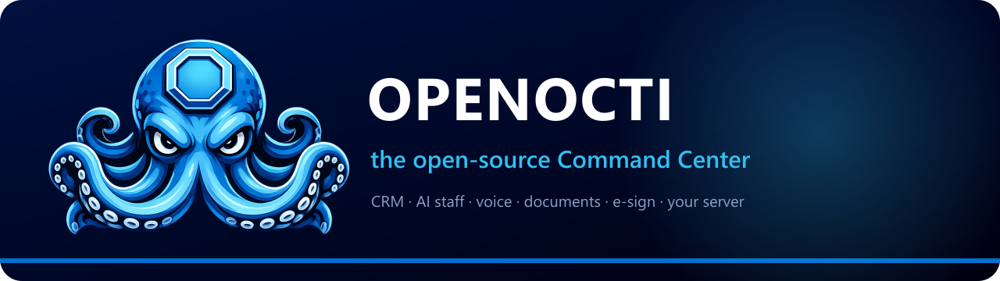
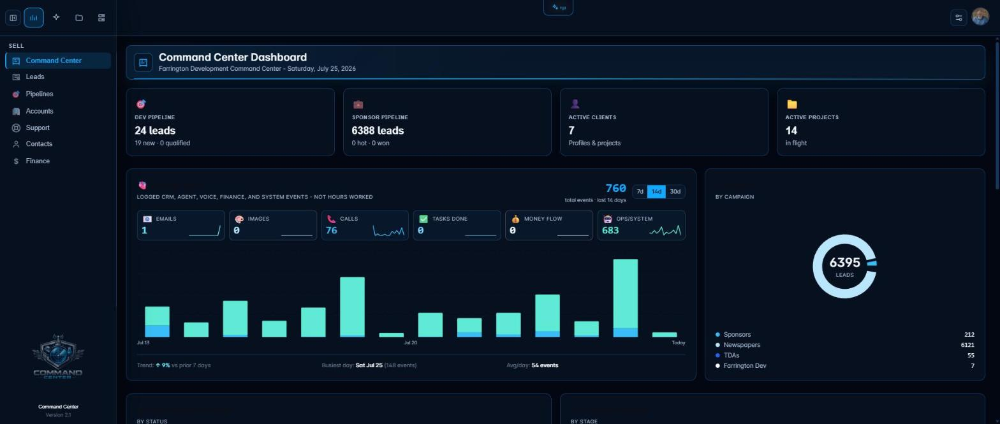
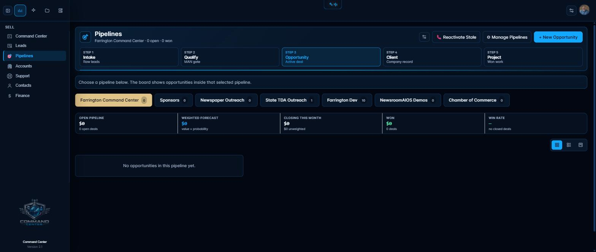
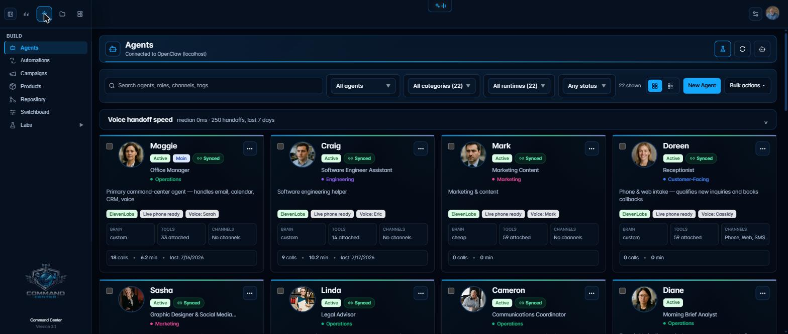

[](LICENSE) [](docs/INSTALL.md) [](#support)

**Run your business from one private command center on your own server.** OpenOcti combines a practical CRM, project operations, documents, voice, and a starter AI staff without requiring a hosted control plane.

[openocti.com](https://openocti.com) · Managed edition: [Octi CC](https://octicc.com)

## Install in three lines

```sh
git clone https://github.com/carlucci001/open-octi.git openocti
cd openocti && cp .env.example .env
docker compose up -d --build
```

Set the six required values at the top of `.env` before starting. The CRM works without an AI provider. Open [http://localhost:3000](http://localhost:3000) after the containers become healthy.

## One key lights it up

Add one of `ANTHROPIC_API_KEY`, `OPENAI_API_KEY`, `GEMINI_API_KEY`, or `OPENROUTER_API_KEY`, then restart the containers. OpenClaw selects that provider at first boot and registers the five starter agents. Existing OpenClaw configuration is never overwritten.

The dashboard asks for a business name and owner name to fill the starter workspaces. Matilda's Gemini Live voice needs `GEMINI_API_KEY`; Maggie, Sasha, and Linda need ElevenLabs and Twilio settings for telephone workflows. Missing providers stay visible as **Not configured** instead of failing silently.

## Meet the staff

| Agent | Role |
| --- | --- |
| **Maggie** | Office coordinator for priorities, CRM follow-up, calendar, tasks, and handoffs. |
| **Craig** | Engineering assistant for evidence-led troubleshooting and technical work. |
| **Sasha** | Creative partner for social drafts, campaign ideas, and visual briefs. |
| **Linda** | Document drafting and issue-spotting assistant with eight neutral templates. |
| **Matilda** | Fast in-app navigation and voice assistant, with Gemini Live when configured. |

OrcaRouter is an optional handoff router. Add `ORCAROUTER_API_KEY` to enable its panel; tests never make a live Orca call.

## What's inside

- Four Lanes CRM: leads, pipelines, accounts, contacts, opportunities, projects, tasks, documents, calendar, and campaigns
- Agent Labs, Sandbox, Harness, orchestration designer, Leads Lab, and the OpenClaw gateway
- Voice paths for ElevenLabs plus Twilio, or Gemini Live and local VibeVoice without ElevenLabs
- Linda's neutral agreements and website policy drafts
- Built-in signature tokens, audit trail, and Resend delivery when `SIGNING_PUBLIC_URL` and `RESEND_API_KEY` are set
- Platform Admin API and SDK, synthetic demo records, and a persistent Docker volume



| Pipelines | AI staff |
| --- | --- |
|  |  |

## Free vs. Octi CC

| | **OpenOcti** | **Octi CC** |
| --- | --- | --- |
| Price | Free, open source | Managed commercial service |
| Where it runs | Your server | Your server or managed infrastructure |
| CRM, projects, documents, campaigns, AI staff | Included | Included |
| Starter agents and OpenClaw gateway | Included | Installed and operated for you |
| Client portal and concierge | — | Included |
| Integrated research desk | — | Included |
| Payments and checkout | — | Included |
| Support | Community | Managed support |

## Guides

- [First run: one key lights it up](docs/guides/first-run.md)
- [Voice receptionist](docs/guides/voice-receptionist.md)
- [Model providers](docs/guides/model-providers.md)
- [E-signature](docs/guides/e-sign.md)
- [Documents and Linda](docs/guides/documents-and-linda.md)
- [Run on a VPS](docs/guides/running-on-a-vps.md)
- [Upgrade safely](docs/guides/upgrading.md)
- [Full installation reference](docs/INSTALL.md)

## Support

Use GitHub Discussions for questions and Issues for reproducible bugs. OpenOcti is community-supported and has no service-level agreement. Managed installation and operations are available through Octi CC.

## License

OpenOcti is licensed under the [GNU Affero General Public License v3.0](LICENSE). Commercial licensing and Octi CC are available separately; see [LICENSE-COMMERCIAL.md](LICENSE-COMMERCIAL.md).

Developed by **Carl Farrington of Farrington Development LLC**.
