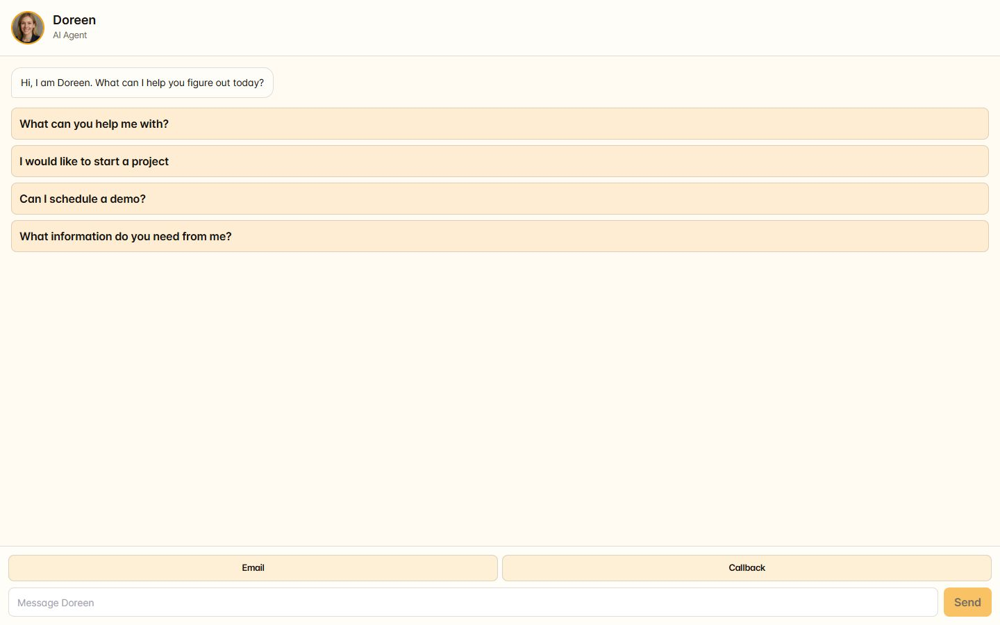

# Agent Widget

## What it does

Agent Widget exposes one configured agent as a small public chat surface that can also collect email or callback handoff requests. The embeddable loader creates a floating button and panel; the full-page route is useful for verification.

## Where it lives

- Preview route: `/agent-widget?agent=<agent-id>`
- Embed loader: `/api/agent-widget.js?agent=<agent-id>`
- Sidebar: configure the source agent under **Build → Agents**; the public widget is not a private sidebar screen.

## Enable it

Choose the agent profile, public name, greeting, prompt suggestions, theme, actions, and whether voice is allowed. Load the preview route, verify the public wording, then add the loader script to the approved website.

## What it needs

- A configured public widget profile and allowed agent identifier.
- A model key for generated chat; otherwise only the implemented fallback response is available.
- A configured voice provider and explicit `voiceEnabled` setting for voice.
- A reviewed human handoff destination for email and callback requests.

## Limits and safety

Email and callback buttons collect a handoff request; they do not guarantee a human response or directly place a call. Treat the widget as public input: keep tools least-privilege, avoid private prompt content, and test rate limits and abuse controls before broad distribution.

