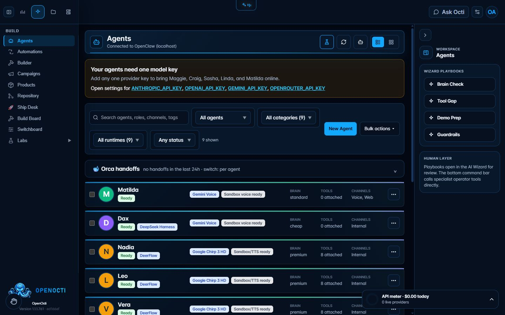

# Agents

## What it does

Agents is the roster for OpenOcti's AI staff. It shows each agent's role, runtime, model tier, tools, channels, voice binding, readiness, and recent handoffs. You can create, filter, inspect, and update agents without pretending an unconfigured runtime is online.

## Where it lives

- Route: `/?tab=agents`
- Sidebar: **Build → Agents**

## Enable it

Open **Models & Keys** and save one supported model-provider key. Return to Agents, open an agent's menu, and configure only the tools and channels it should use. Connect an OpenClaw gateway when you want runtime execution instead of roster-only configuration.

## What it needs

- One supported model key for language work.
- A reachable OpenClaw gateway for connected runtime status and execution.
- Separate voice, email, web, or messaging credentials for those channels.

## Limits and safety

An agent can appear in the roster while disabled or offline. A model key does not grant tool or channel permission. Voice-ready status also requires a compatible voice provider and binding. Review handoffs and external actions before sending them.

