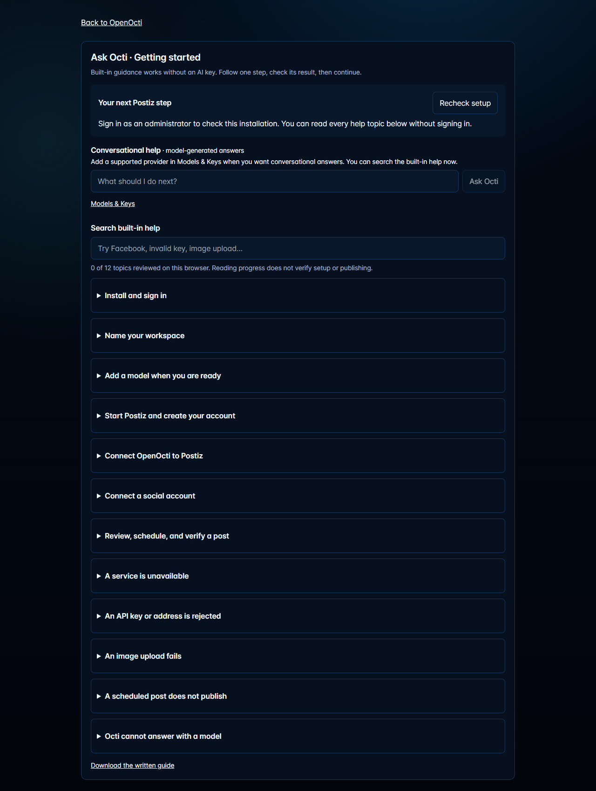
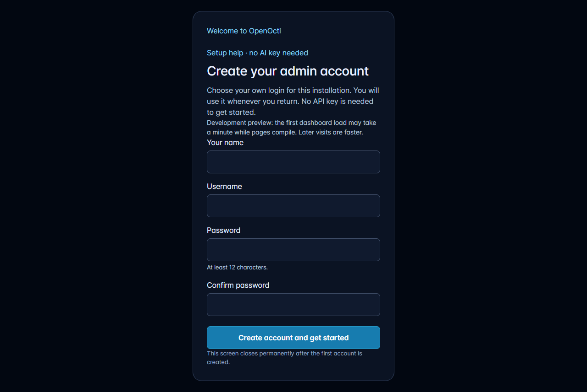
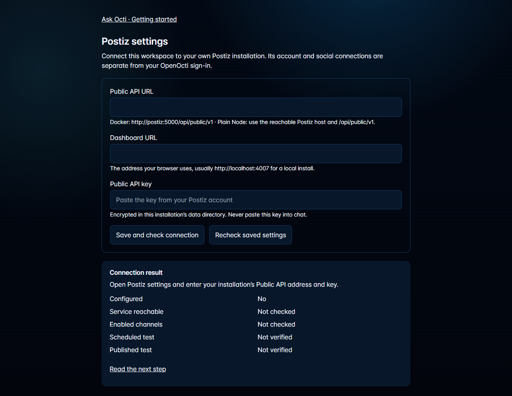
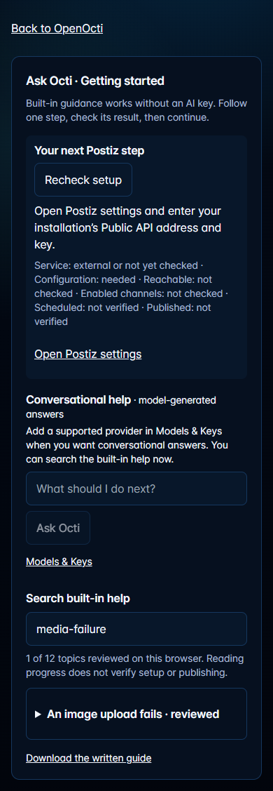

# Getting started with OpenOcti and Postiz

This guide ships with the installed version. In OpenOcti, open **Ask Octi** or **/help** at any time. Built-in help and this file do not require a model key. Installation checks and conversational answers require administrator sign-in. Reviewed topics are remembered in this browser; a checkmark means you read the topic, not that a service or post was verified.

## Before installing

Use Docker Engine with Compose v2.24 or newer (or Docker Desktop), Git, and available disk and memory for OpenOcti plus the Postiz services. Reserve at least 8 GB RAM and 15 GB free disk for the combined development installation. Ports 3000 (OpenOcti) and 4007 (Postiz) must be available; use OPENOCTI_PORT and POSTIZ_PORT to change them. For plain Node, use Node.js 24 or newer.

## Docker installation

From the downloaded OpenOcti directory, run:

~~~sh
node scripts/setup-openocti-postiz.mjs
docker compose config --quiet
docker compose up -d
docker compose ps
~~~

If Node is not installed on the host, run the first command inside a temporary Node container instead:

~~~sh
docker run --rm -v "${PWD}:/workspace" -w /workspace node:24-bookworm-slim node scripts/setup-openocti-postiz.mjs
~~~

The setup command creates three unique Postiz secrets in .env without displaying them. Re-running it preserves existing secrets. Protect and back up this file. Your social provider settings belong in a separate, optional postiz.env file read only by Postiz. Do not put private records or another installation's credentials in either file.

OpenOcti, OpenClaw, Postiz, Postiz PostgreSQL, Redis, Temporal, Temporal PostgreSQL, and Temporal Elasticsearch start by default. The application can show setup help while Postiz is unavailable. Research services remain opt-in. The first download/start may take several minutes.

Open http://localhost:3000 for OpenOcti and http://localhost:4007 for Postiz. Create your own administrator and Postiz accounts. If you configured an initial OpenOcti administrator password, use it at first sign-in.

For another port or a public host, set PUBLIC_APP_URL to the OpenOcti browser address and POSTIZ_PUBLIC_URL to the Postiz browser address without a trailing slash. For POSTIZ_PORT=4017, also set POSTIZ_PUBLIC_URL=http://localhost:4017. Keep the Postiz internal API address at http://postiz:5000/api/public/v1. The dashboard binds to loopback by default; use your reverse proxy for public HTTPS and the provider's exact callback URL. Set POSTIZ_DISABLE_REGISTRATION=true after creating the accounts you need, then recreate the service with docker compose up -d postiz.

## Plain Node installation

Install the application using docs/INSTALL.md. Postiz is a separate service even when OpenOcti runs with Node. Either run this package's Postiz stack with docker compose up -d postiz (after generating secrets), follow the upstream Postiz installation guide on your own server, or use your own hosted Postiz account. For a Node app on the same host, use http://localhost:4007/api/public/v1 in Postiz settings. For hosted Postiz, use https://api.postiz.com/public/v1 and https://platform.postiz.com as the dashboard URL.

## Setup walkthrough
### Install and sign in

1. Install Node.js 24 or newer for a plain Node installation, or Docker with Compose for the packaged installation.
2. For Docker, run node scripts/setup-openocti-postiz.mjs, then docker compose up -d. The setup command creates installation secrets without displaying them.
3. Open your OpenOcti address and complete the first administrator setup. Keep your administrator password in your password manager.

**Expected result:** You can sign in to your own OpenOcti workspace.

**In-app screen:** /login

### Name your workspace

1. Sign in as an administrator.
2. Use the Getting started panel to save your business and owner names.

**Expected result:** Your own workspace name appears in OpenOcti.

**In-app screen:** /

### Add a model when you are ready

1. Open Models & Keys and choose a supported provider.
2. Save your own provider key in its dedicated password field and run the connection check.
3. Return here to try a question. A saved key verifies configuration; a successful answer verifies model execution.

**Expected result:** Conversational help becomes available. Built-in help remains usable if the model fails.

**In-app screen:** /settings/models

### Start Postiz and create your account

1. The supported Docker installation includes Postiz, PostgreSQL, Redis, Temporal, and Temporal storage. Allow several minutes for the first start.
2. Open Postiz from Postiz settings. Create an account on your own installation; its sign-in is separate from OpenOcti.
3. For plain Node installations, install the Postiz service stack separately or use your own hosted Postiz subscription.

**Expected result:** Your Postiz dashboard opens and you can sign in. No social account is connected yet.

**In-app screen:** /settings/postiz

### Connect OpenOcti to Postiz

1. In your Postiz dashboard, find the Public API key in settings.
2. In OpenOcti Postiz settings, enter the complete Public API URL and paste the key in the secure API key field. For the bundled Docker stack the internal address is http://postiz:5000/api/public/v1.
3. Use the browser-facing Postiz address for Dashboard URL, usually http://localhost:4007 locally. Save, then recheck. Never paste a key into chat.

**Expected result:** The API check succeeds and reports a channel count. Zero channels means the connection works but a social account still needs connecting.

**In-app screen:** /settings/postiz

### Connect a social account

1. Open your Postiz dashboard and choose the social provider you want to connect.
2. Follow that provider’s setup instructions. Some require your own developer application, matching callback URL, approved permissions, and a public HTTPS address.
3. Authorize an account you control, then return to OpenOcti and recheck. Installing Postiz alone does not connect Facebook.

**Expected result:** At least one enabled channel is reported. Publishing has not been tested yet.

**In-app screen:** /settings/postiz

### Review, schedule, and verify a post

1. Choose an authorized test channel in Social Publishing. Write a caption and upload an image you are allowed to publish; image generation is optional.
2. Review the channel, caption, image, date, time, and time zone before submitting.
3. Schedule the test post and inspect its status in Postiz. A scheduled post is not yet published.
4. After the scheduled time, open the destination social platform and verify the caption and image there.

**Expected result:** The post is visible on the destination platform. Only that final check confirms successful publishing.

**In-app screen:** /?tab=social

### A service is unavailable

1. Run docker compose ps and check whether Postiz and its dependencies are healthy.
2. Check docker compose logs --tail 80 postiz and the unhealthy dependency locally. Logs may contain sensitive information; do not paste them into chat.
3. For Docker-to-Docker connections use postiz:5000, not localhost. For a plain Node app use the reachable host address.
4. After correcting configuration, run docker compose up -d and recheck. Do not delete volumes to fix a connection error.

**Expected result:** The service responds; the separate API-key and channel checks can then run.

**In-app screen:** /settings/postiz

### An API key or address is rejected

1. Verify the URL ends in /api/public/v1 for self-hosted Postiz, or /public/v1 for the hosted API.
2. A login page or HTML response usually means the address is the dashboard rather than the Public API.
3. Replace the key in the secure settings field with a key from this same Postiz installation. Save and recheck.

**Expected result:** The connection check returns a valid channel list, even if it is empty.

**In-app screen:** /settings/postiz

### An image upload fails

1. Check the image format and size against your destination provider’s current limits.
2. Check that the Postiz uploads volume is writable and has free space.
3. If Postiz fetches an image by URL, that URL must be reachable from Postiz. localhost inside a container refers to that container.
4. Retry the image upload before scheduling the post.

**Expected result:** The image appears in the reviewed post. Uploading an image does not confirm publication.

**In-app screen:** /?tab=social

### A scheduled post does not publish

1. Open the failed post in Postiz and read its provider error.
2. Check that the connected account is enabled, its authorization is current, and the content meets the platform’s restrictions.
3. Verify Temporal and its storage are healthy if posts remain pending.
4. Check the destination platform before retrying to avoid a duplicate post. Reauthorize the social account when required.

**Expected result:** The retry succeeds and you verify the post on the destination platform.

**In-app screen:** /?tab=social

### Octi cannot answer with a model

1. Use the built-in topics here while the model is unavailable.
2. Check the provider key in Models & Keys and your provider account’s model access and usage limits.
3. Try again after resolving the provider error. OpenOcti does not borrow another installation’s credentials or funded usage.

**Expected result:** A supported model answers a question; basic help stays available throughout.

**In-app screen:** /settings/models

## Provider accounts and callback URLs

Installing Postiz does not authorize Facebook or any other social account. Use the provider's official developer console and the exact callback URL displayed by your Postiz version. Supply your own app ID and secret through postiz.env where required, then run docker compose up -d postiz. Follow Postiz's provider guide at https://docs.postiz.com/self-host/providers/overview and the provider's current permissions, review, account-type, and HTTPS requirements. Verify each image URL is reachable from Postiz; a container's localhost is not the host machine.

## Update, restart, backup, and recovery

Before an update, back up the OpenOcti data volume, Postiz config/uploads/PostgreSQL/Redis volumes, Temporal PostgreSQL/Elasticsearch volumes, .env, and postiz.env. For a consistent volume backup, stop this installation's services first, snapshot every named volume with your Docker host's volume backup facility, then start the same installation. Alternatively, use PostgreSQL dumps and the corresponding supported backups for the other services. Backups contain credentials and social tokens; keep them private.

Use the approved new OpenOcti release directory and preserve its Compose project name so it reuses the same volumes. Review the bundled upstream migration notes, then run docker compose pull followed by docker compose up -d. Verify docker compose ps, both sign-ins, API connectivity, and an authorized test post. Changing the Compose project name creates different volumes and can look like lost data.

Do not remove volumes to repair a connection. docker compose down keeps volumes; adding -v deletes them. For rollback after a database migration, restore the matching pre-update volumes and configuration together with the previous pinned images. Merely downgrading an image may not reverse a database migration.

## How Ask Octi works

Built-in help comes from this package's versioned instructions. Conversational setup help sends those instructions, your question, and sanitized Postiz state to a supported provider configured in this installation. It has no CRM action tools and cannot publish a post. A provider failure leaves the built-in guide available. The older OpenClaw runtime name resolves through this installation's OPENCLAW_HOST/PORT; setup help does not require that gateway or a private hosted service.

For upstream service help, see https://docs.postiz.com/self-host/installation/docker-compose and deploy/postiz/UPSTREAM.md. For an application issue, use https://github.com/carlucci001/open-octi/issues and describe the failing step without posting keys, cookies, private records, or raw logs.

## Screens from this implementation

