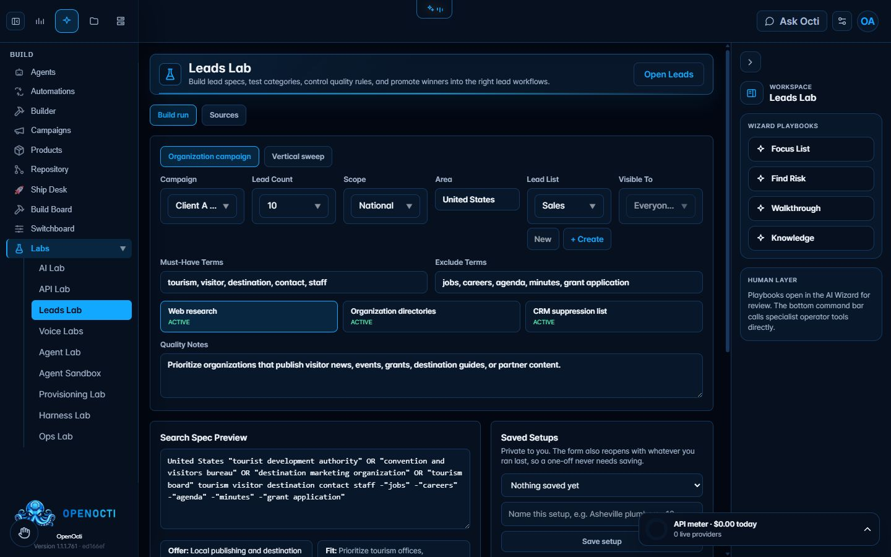

# Labs

## What it does

Labs groups guarded workspaces for model comparison, API inspection, lead-source experiments, voice tests, agent behavior, quarantined agent templates, provisioning, runtime harnesses, and operational checks.

## Where it lives

- Routes: `/?tab=nvidia-labs`, `api-lab`, `leads-lab`, `voice-labs`, `agent-labs`, `agent-sandbox`, `provisioning-lab`, `harness`, and `ops`.
- Sidebar: **Build → Labs**, then choose a lab.

## Enable it

There is no global Labs switch. Open the required lab and configure only the provider or runtime needed for that experiment. Leads Lab can build a search specification and promote an approved result; Agent Sandbox can quarantine a template before promotion.

## What it needs

- Model or API keys for provider-backed experiments.
- Microphone, camera, telephony, or voice credentials for the corresponding voice tests.
- A reachable runtime for agent and harness execution.
- Operator or admin access for guarded actions.

## Limits and safety

Lab labels do not mean every provider is installed. Preview and sample results do not change live routing by themselves; explicit assignment or promotion is required where supported. Never use customer data in a provider experiment without the required permission.

