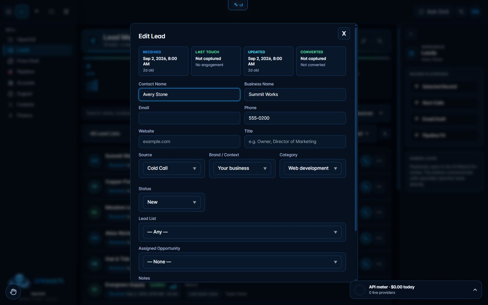

# Operator rail

## What it does

The Operator rail keeps contextual AI playbooks beside the current workspace. It follows the active section and, where a screen publishes one, the selected record. Lead playbooks can therefore use the visible lead context instead of starting from a generic prompt.

## Where it lives

- Route: available beside authenticated workspace routes on desktop widths.
- Sidebar: it is the right-hand rail, not a separate sidebar item.

## Enable it

The rail is included in OpenOcti. Use the chevron on its edge to collapse or reopen it. Open a record, then choose a Wizard Playbook such as **Next Calls** or **Clean Data**.

## What it needs

- A desktop viewport at least 1024 pixels wide.
- A configured model key to produce AI output.
- A screen that publishes record context for record-specific prompts.

## Limits and safety

Playbooks open the AI Wizard for human review; choosing one does not automatically mutate a record, send a message, or run a deployment. Collapsed state is stored in the browser. Small screens hide the full rail to protect the working area.

